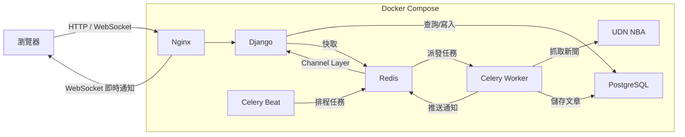

# Unnotech Backend Engineer 徵才小專案

1. 抓取 http://tw-nba.udn.com/nba/index 中的焦點新聞。
2. 使用 [Django](https://www.djangoproject.com/) 設計恰當的 Model，並將所抓取新聞存儲至 DB。
3. 使用 [Django REST Framework](http://www.django-rest-framework.org/) 配合 AJAX 實現以下頁面：
   - 焦點新聞列表
   - 新聞詳情頁面
4. 以 Pull-Request 的方式將代碼提交。

## 進階要求

1. 實現爬蟲自動定時抓取。
2. 使用 Websocket 服務，抓取到新的新聞時立即通知前端頁面。
3. 將本 demo 部署到伺服器並可正確運行。
4. 所實現新聞列表 API 可承受 100 QPS 的壓力測試。

## 專案說明

本專案為 UDN NBA 焦點新聞爬蟲與展示系統。系統自動抓取[聯合新聞網 NBA 頁面](http://tw-nba.udn.com/nba/index)的焦點新聞，存入 PostgreSQL 資料庫，並透過 Django REST Framework 提供 API，前端以 AJAX 方式呈現新聞列表與詳情頁面。

線上版本：http://35.206.126.166/

---

### 系統架構



- **使用者請求**：瀏覽器透過 Nginx 存取 Django，Django 從 PostgreSQL 讀取資料（或從 Redis 取得快取）後回傳
- **定時爬蟲**：Celery Beat 每小時將任務送入 Redis，Celery Worker 領取後抓取 UDN NBA 新聞並存入 PostgreSQL
- **即時通知**：Worker 存入新文章後，透過 Redis Channel Layer 通知 Django，再經 Nginx 以 WebSocket 推送至瀏覽器

---

### 技術棧

| 類別             | 技術                                           |
| ---------------- | ---------------------------------------------- |
| Backend          | Django 5.1、Django REST Framework              |
| Database         | PostgreSQL 16                                  |
| Cache / Broker   | Redis 7                                        |
| Task Queue       | Celery + Celery Beat                           |
| WebSocket        | Django Channels + channels-redis               |
| Scraper          | Requests + BeautifulSoup4 (lxml)               |
| Web Server       | Gunicorn + Uvicorn (ASGI)、Nginx reverse proxy |
| Containerization | Docker、Docker Compose                         |
| Frontend         | Django Templates + JavaScript fetch API        |
| Deployment       | GCP Compute Engine VM                          |

---

### 已完成功能

- 爬蟲抓取 UDN NBA 焦點新聞（兩階段：列表頁 → 文章頁），以 `source_url` 去重
- REST API：分頁新聞列表（`GET /api/news/`）與新聞詳情（`GET /api/news/<id>/`）
- 前端頁面：新聞列表頁與詳情頁，使用 JavaScript fetch 呼叫 API 渲染
- Celery Beat 定時排程，每小時自動執行爬蟲
- WebSocket 即時通知，爬蟲抓到新文章時推送至前端
- Redis 快取列表 API 回應（TTL 60 秒），列表查詢使用 `defer("content")` 減少資料量
- Nginx 反向代理 + 靜態檔案託管
- 部署至 GCP VM，對外提供服務

---

### 如何在本地啟動

#### 前置需求

- [Docker](https://docs.docker.com/get-docker/) 與 [Docker Compose](https://docs.docker.com/compose/install/)

#### 步驟

1. **複製環境變數檔案**

```bash
cp .env.example .env
```

可依需求修改 `.env` 中的設定值（預設值即可在本地開發環境運行）。

2. **啟動所有服務**

```bash
docker compose up --build
```

此指令會建立並啟動以下服務：

| 服務            | 說明                                            |
| --------------- | ----------------------------------------------- |
| `web`           | Django ASGI 伺服器（Gunicorn + Uvicorn）        |
| `db`            | PostgreSQL 16 資料庫                            |
| `redis`         | Redis 7（快取 + Celery Broker + Channel Layer） |
| `celery_worker` | Celery Worker（執行爬蟲任務）                   |
| `celery_beat`   | Celery Beat（定時排程）                         |
| `nginx`         | Nginx 反向代理（port 80）                       |

啟動時 `web` 容器會自動執行資料庫遷移、收集靜態檔案、以及執行一次爬蟲（見 `entrypoint.sh`）。

3. **開啟瀏覽器**

- 新聞列表頁：http://localhost/
- Django Admin：http://localhost/admin/（需先建立管理員帳號）

4. **建立管理員帳號**（可選）

```bash
docker compose exec web python manage.py createsuperuser
```

---

### 環境變數

參考 `.env.example`：

| 變數名稱            | 說明              | 預設值      |
| ------------------- | ----------------- | ----------- |
| `DJANGO_SECRET_KEY` | Django Secret Key | `change-me` |
| `DEBUG`             | 除錯模式          | `True`      |
| `POSTGRES_DB`       | 資料庫名稱        | `udn_nba`   |
| `POSTGRES_USER`     | 資料庫使用者      | `postgres`  |
| `POSTGRES_PASSWORD` | 資料庫密碼        | `postgres`  |
| `POSTGRES_HOST`     | 資料庫主機        | `db`        |
| `POSTGRES_PORT`     | 資料庫連接埠      | `5432`      |

---

### 執行爬蟲

系統啟動後，Celery Beat 會每小時自動觸發爬蟲。如需手動執行：

```bash
docker compose exec web python manage.py scrape_news
```

爬蟲執行兩階段抓取：

1. 從 UDN NBA 首頁解析焦點新聞輪播區，取得各篇文章連結。
2. 逐一進入文章頁面，擷取標題、作者、發佈時間、內文、主圖等欄位。

執行完畢後會顯示結果摘要（新增 / 略過重複 / 失敗筆數）。以 `source_url` 做去重，重複執行不會產生重複資料。

---

### API 文件

Base URL：http://35.206.126.166（本地開發為 `http://localhost`）

#### 1. 新聞列表

```
GET /api/news/
```

回傳分頁的新聞列表（每頁 10 筆，依發佈時間降冪排序）。列表不包含 `content` 欄位以減少傳輸量。

**Query Parameters:**

| 參數   | 說明           |
| ------ | -------------- |
| `page` | 頁碼（預設 1） |

**Response 範例:**

```json
{
  "count": 12,
  "next": "http://35.206.126.166/api/news/?page=2",
  "previous": null,
  "results": [
    {
      "id": 1,
      "title": "NBA 季後賽焦點戰報",
      "author": "記者王小明",
      "published_at": "2026-03-20T18:30:00+08:00",
      "hero_image_url": "https://pgw.udn.com.tw/..."
    }
  ]
}
```

#### 2. 新聞詳情

```
GET /api/news/<id>/
```

回傳單篇新聞的完整資料（含內文 HTML）。

**Response 範例:**

```json
{
  "id": 1,
  "title": "NBA 季後賽焦點戰報",
  "author": "記者王小明",
  "published_at": "2026-03-20T18:30:00+08:00",
  "source_name": "聯合報",
  "source_url": "https://udn.com/news/story/...",
  "content": "<p>文章內文 HTML...</p>",
  "hero_image_url": "https://pgw.udn.com.tw/...",
  "hero_image_caption": "圖片說明文字",
  "created_at": "2026-03-20T19:00:00+08:00",
  "updated_at": "2026-03-20T19:00:00+08:00"
}
```

---

### WebSocket 即時通知

前端列表頁會透過 WebSocket 連線至 `ws://<host>/ws/news/`。當爬蟲抓到新文章時，伺服器會即時推送通知，前端收到後自動顯示提示，無需手動重新整理頁面。

---

### 技術選型

以下記錄三個影響架構的關鍵決策與取捨，完整比較表見 [`docs/tech-choice.md`](docs/tech-choice.md)。

#### Gunicorn + Uvicorn 取代 Daphne

Daphne 為 Django Channels 官方 ASGI 伺服器，但其單一程序架構在 100 QPS 壓力測試下出現請求排隊，p95 延遲逼近 500ms 上限且丟棄 4.9% 的請求。改用 Gunicorn 搭配 Uvicorn Worker 後，透過 pre-fork 模型產生多個 Worker 程序，各自擁有獨立 event loop，p95 延遲降至 34ms、丟棄率降至 0.4%。WebSocket 路由（`ProtocolTypeRouter`）無需修改即可相容。

> **取捨**：多了 `gunicorn`、`uvicorn` 兩個依賴，但換來可量化的效能提升與生產環境標準部署模式。

#### 單一 Redis 實例，以 DB 編號隔離用途

Cache（DB 1）、Celery Broker（DB 0）、Channel Layer（DB 0）共用同一個 Redis 容器。在本專案的負載規模下（快取讀取 ~100KB/s、Celery 每小時一次任務、少量 WebSocket 廣播），資源競爭與記憶體壓力幾乎不存在，`cache.clear()` 呼叫 `FLUSHDB` 也只影響所選 DB，不會誤刪任務佇列。

> **取捨**：犧牲了物理隔離（獨立 eviction policy、獨立故障域），換取更簡單的基礎設施。若流量成長至需要為 Cache 設定 `allkeys-lru` 而 Broker 需要 `noeviction` 時，應拆為兩個 Redis 容器。

#### Celery Beat 取代 Cron Job

定時爬蟲使用 Celery Beat 排程而非系統層級的 cron job。Celery Beat 的排程定義在 `settings.py` 的 `CELERY_BEAT_SCHEDULE` 中，與應用程式碼一同版本控管，且任務執行於 Celery Worker 中，可直接取用 Django ORM 與 Channel Layer（爬蟲完成後透過 WebSocket 推送通知）。若使用 cron，則需額外維護 crontab 設定、處理 Django 環境初始化、並另尋機制觸發 WebSocket 通知。

> **取捨**：多了 `celery_worker` 與 `celery_beat` 兩個常駐容器（佔用約 50–80MB 記憶體），但換來排程、任務執行、即時通知的一體化整合。若專案不需要 WebSocket 通知且只需簡單定時觸發，cron + management command 會是更輕量的選擇。

---

### 效能優化

為使新聞列表 API 能承受 100 QPS 以上的壓力，採取以下措施：

- **Redis 快取**：列表 API 回應快取 60 秒（`@cache_page(60)`），大幅減少資料庫查詢次數
- **查詢優化**：列表查詢使用 `defer("content")` 避免載入大量內文欄位
- **ASGI 伺服器**：使用 Gunicorn + Uvicorn Worker 處理並行請求
- **Nginx 反向代理**：前端靜態檔案由 Nginx 直接服務，減輕 Django 負擔

壓力測試使用 [k6](https://k6.io/)，測試腳本位於 `tests/load_test.js`，以 100 RPS 持續 30 秒，目標 p95 延遲低於 500ms：

```bash
# 安裝 k6（macOS）
brew install k6

# 執行壓力測試（需先確認服務已啟動）
k6 run tests/load_test.js
```

#### 測試結果

測試使用 k6 的 `constant-arrival-rate` 執行器，以固定每秒 100 次請求的速率持續 30 秒（預計共 3,000 次請求）。當伺服器處理不及、所有虛擬用戶皆忙碌時，k6 會跳過排程中的請求（即「丟棄迭代」），因此丟棄數量越高代表伺服器越無法承受目標負載。

| 指標         | Daphne（單一程序）  | Gunicorn + 2 Uvicorn Workers |
| ------------ | ------------------- | ---------------------------- |
| 實際吞吐量   | 95.1 req/s          | 99.6 req/s                   |
| 平均延遲     | 78.65ms             | 12.34ms                      |
| p95 延遲     | 493.99ms            | 33.96ms（改善 14.5 倍）      |
| 丟棄的請求數 | 146 / 3,000（4.9%） | 12 / 3,000（0.4%）           |
| 錯誤率       | 0.00%               | 0.00%                        |

單一程序 Daphne 在高負載下請求排隊嚴重，3,000 次預定請求中有 146 次因處理不及而被跳過，實際吞吐量僅 95.1 req/s，未能完全維持 100 QPS 目標。改用 Gunicorn + 2 Uvicorn Workers 後，僅丟棄 12 次請求，吞吐量達 99.6 req/s，p95 延遲從 ~494ms 大幅降至 ~34ms，有效達成目標且仍有餘裕。完整測試報告見 [`docs/performance.md`](docs/performance.md)。

---

### 執行測試

```bash
docker compose exec web python manage.py test
```

測試涵蓋：

- **Model 測試**：建立、欄位驗證、`source_url` 唯一約束
- **API 測試**：列表分頁、詳情回應、404 處理
- **Scraper 測試**：HTML 解析邏輯

---

### 專案結構

```
nicetomeetyou/
├── config/                      # Django 專案設定
│   ├── settings.py              #   主設定檔（DB、DRF、Celery、Channels、Cache）
│   ├── urls.py                  #   URL 路由總入口
│   ├── celery.py                #   Celery 設定
│   ├── asgi.py                  #   ASGI 入口（HTTP + WebSocket）
│   └── wsgi.py
├── news/                        # 新聞 App
│   ├── models.py                #   News 資料模型
│   ├── serializers.py           #   DRF 序列化器（List / Detail）
│   ├── views.py                 #   API views + 頁面 views
│   ├── urls.py                  #   URL 路由（API + 頁面）
│   ├── admin.py                 #   Django Admin 設定
│   ├── scraper.py               #   爬蟲核心邏輯
│   ├── tasks.py                 #   Celery 非同步任務
│   ├── consumers.py             #   WebSocket Consumer
│   ├── routing.py               #   WebSocket URL 路由
│   ├── management/commands/
│   │   └── scrape_news.py       #   爬蟲 Management Command
│   ├── templates/news/          #   HTML 模板
│   ├── static/news/css/         #   CSS 樣式
│   ├── tests/                   #   測試
│   │   ├── test_models.py
│   │   ├── test_api.py
│   │   └── test_scraper.py
│   └── migrations/              #   資料庫遷移檔
├── nginx/
│   └── default.conf             # Nginx 設定
├── tests/
│   └── load_test.js             # k6 壓力測試腳本
├── docker-compose.yml           # Docker Compose 設定（6 個服務）
├── Dockerfile                   # Docker 映像檔定義
├── entrypoint.sh                # 容器啟動腳本（migrate + collectstatic + scrape）
├── requirements.txt             # Python 套件依賴
├── .env.example                 # 環境變數範本
└── manage.py
```

### 資料模型 (News)

| 欄位                 | 型別              | 說明                     |
| -------------------- | ----------------- | ------------------------ |
| `id`                 | AutoField (PK)    | 主鍵                     |
| `title`              | CharField(500)    | 新聞標題                 |
| `author`             | CharField(200)    | 作者（可為空）           |
| `published_at`       | DateTimeField     | 原始發佈時間             |
| `source_name`        | CharField(100)    | 來源名稱（如「聯合報」） |
| `source_url`         | URLField (unique) | 原始文章連結（去重依據） |
| `content`            | TextField         | 清理後的 HTML 內文       |
| `hero_image_url`     | URLField          | 主圖 URL（可為空）       |
| `hero_image_caption` | CharField(300)    | 主圖說明（可為空）       |
| `created_at`         | DateTimeField     | 資料建立時間             |
| `updated_at`         | DateTimeField     | 資料更新時間             |
